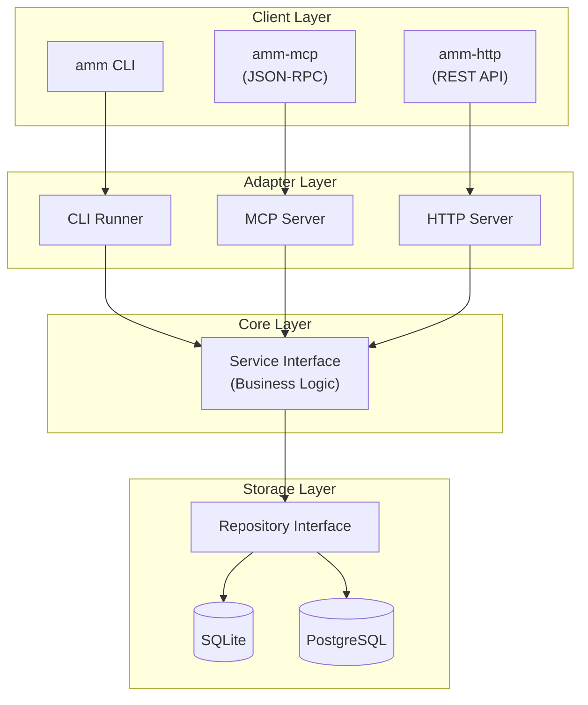
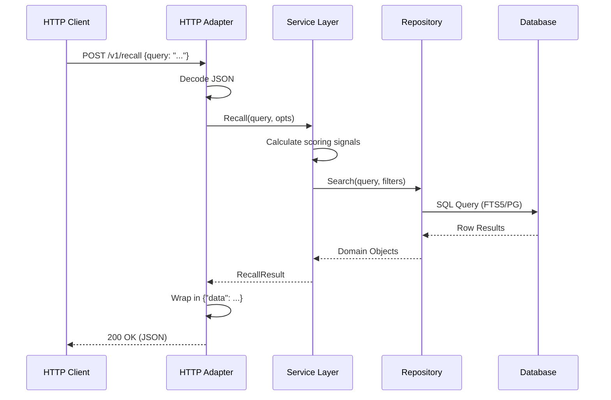
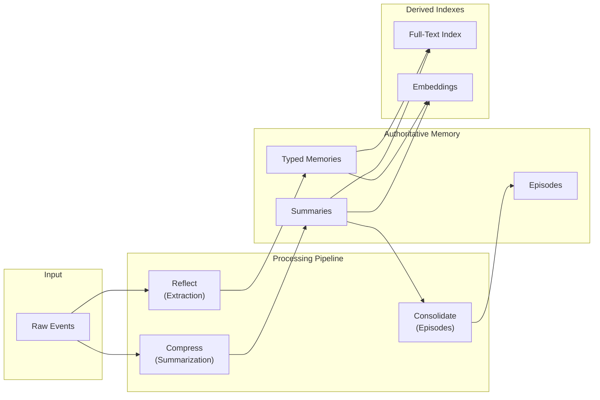
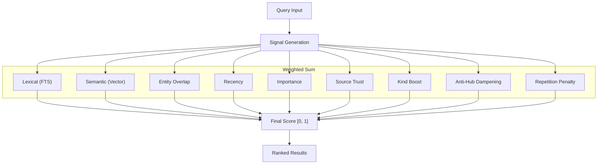
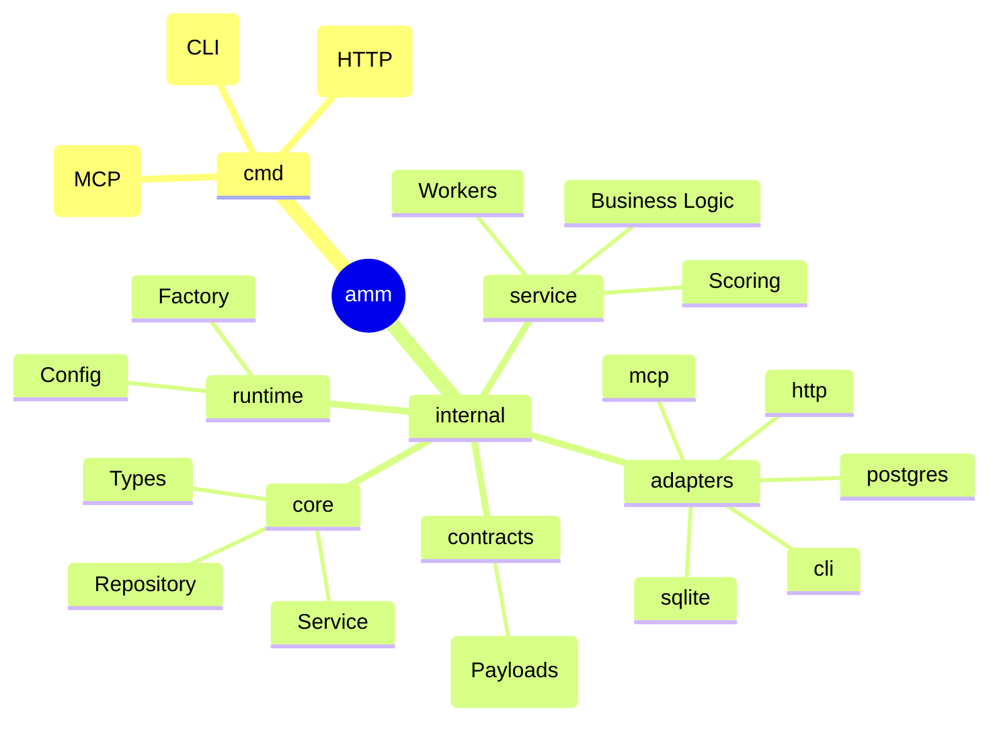

# AMM Architecture Diagrams

## System Context

```mermaid
flowchart TB
    subgraph Client["Client Layer"]
        CLI["amm CLI"]
        MCP["amm-mcp
        (JSON-RPC)"]
        HTTP["amm-http
        (REST API)"]
    end

    subgraph Adapter["Adapter Layer"]
        CLIRunner["CLI Runner"]
        MCPServer["MCP Server"]
        HTTPServer["HTTP Server"]
    end

    subgraph Core["Core Layer"]
        Service["Service Interface
        (Business Logic)"]
    end

    subgraph Storage["Storage Layer"]
        Repo["Repository Interface"]
        SQLite[("SQLite")]
        Postgres[("PostgreSQL")]
    end

    CLI --> CLIRunner
    MCP --> MCPServer
    HTTP --> HTTPServer
    
    CLIRunner --> Service
    MCPServer --> Service
    HTTPServer --> Service

    Service --> Repo
    Repo --> SQLite
    Repo --> Postgres
```

## Request Flow (HTTP Example)

```mermaid
sequenceDiagram
    participant Client as HTTP Client
    participant Server as HTTP Adapter
    participant Service as Service Layer
    participant Repo as Repository
    participant DB as Database

    Client->>Server: POST /v1/recall {query: "..."}
    Server->>Server: Decode JSON
    Server->>Service: Recall(query, opts)
    Service->>Service: Calculate scoring signals
    Service->>Repo: Search(query, filters)
    Repo->>DB: SQL Query (FTS5/PG)
    DB-->>Repo: Row Results
    Repo-->>Service: Domain Objects
    Service-->>Server: RecallResult
    Server->>Server: Wrap in {"data": ...}
    Server-->>Client: 200 OK (JSON)
```

## Data Lifecycle

```mermaid
flowchart LR
    subgraph Input["Input"]
        E["Raw Events"]
    end

    subgraph Processing["Processing Pipeline"]
        Reflect["Reflect
        (Extraction)"]
        Compress["Compress
        (Summarization)"]
        Consolidate["Consolidate
        (Episodes)"]
    end

    subgraph Storage["Authoritative Memory"]
        M["Typed Memories"]
        S["Summaries"]
        Ep["Episodes"]
    end

    subgraph Search["Derived Indexes"]
        FTS["Full-Text Index"]
        Vec["Embeddings"]
    end

    E --> Reflect
    E --> Compress
    
    Reflect --> M
    Compress --> S
    S --> Consolidate
    Consolidate --> Ep
    
    M --> FTS
    S --> FTS
    M --> Vec
    S --> Vec
```

## Scoring Pipeline

```mermaid
flowchart TD
    Q["Query Input"] --> Signals["Signal Generation"]
    
    subgraph Scoring["Weighted Sum"]
        Lex["Lexical (FTS)"]
        Sem["Semantic (Vector)"]
        Ent["Entity Overlap"]
        Rec["Recency"]
        Imp["Importance"]
        Trust["Source Trust"]
        Boost["Kind Boost"]
        Hub["Anti-Hub Dampening"]
        Rep["Repetition Penalty"]
    end

    Signals --> Lex
    Signals --> Sem
    Signals --> Ent
    Signals --> Rec
    Signals --> Imp
    Signals --> Trust
    Signals --> Boost
    Signals --> Hub
    Signals --> Rep

    Lex & Sem & Ent & Rec & Imp & Trust & Boost & Hub & Rep --> Sum["Final Score [0, 1]"]
    Sum --> Rank["Ranked Results"]
```

## Module Layout

```mermaid
mindmap
  root((amm))
    cmd
      amm (CLI)
      amm-mcp (MCP)
      amm-http (HTTP)
    internal
      core
        Service
        Types
        Repository
      service
        Business Logic
        Scoring
        Workers
      adapters
        cli
        mcp
        http
        sqlite
        postgres
      contracts
        v1 (Payloads)
      runtime
        Config
        Factory
```
