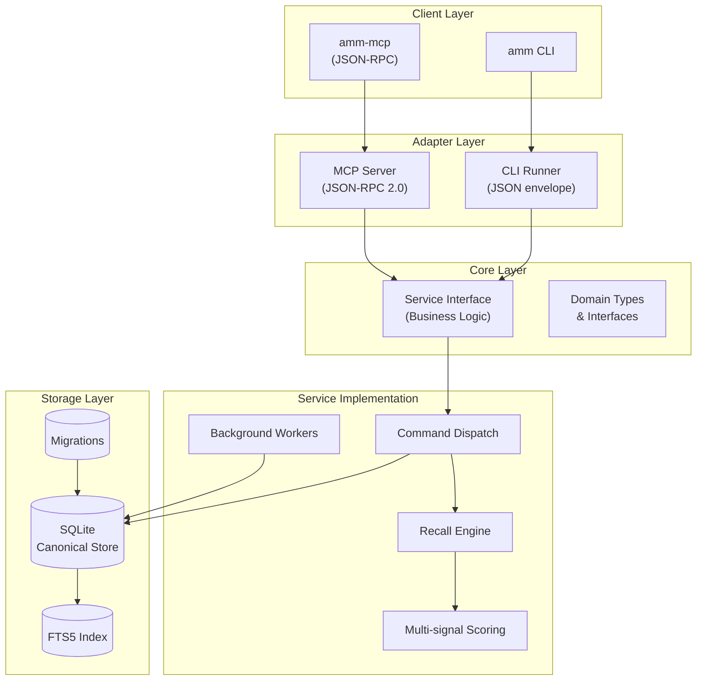
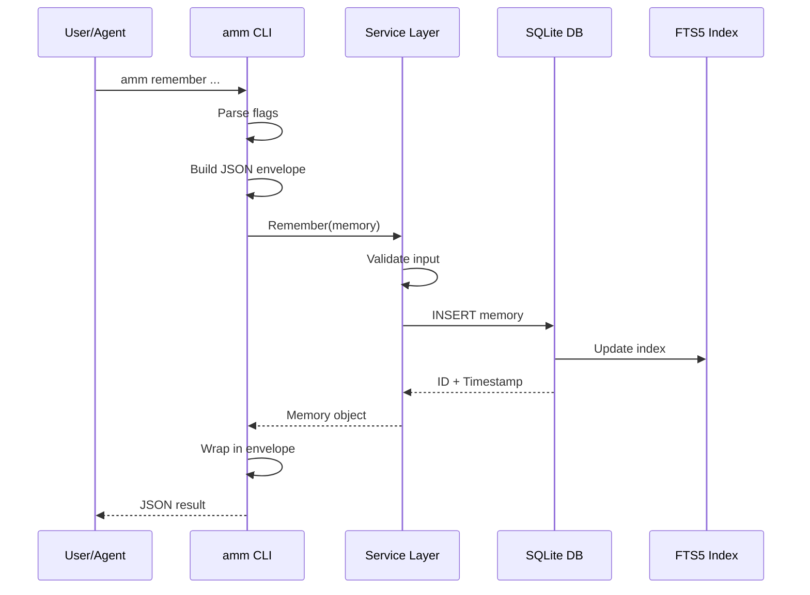
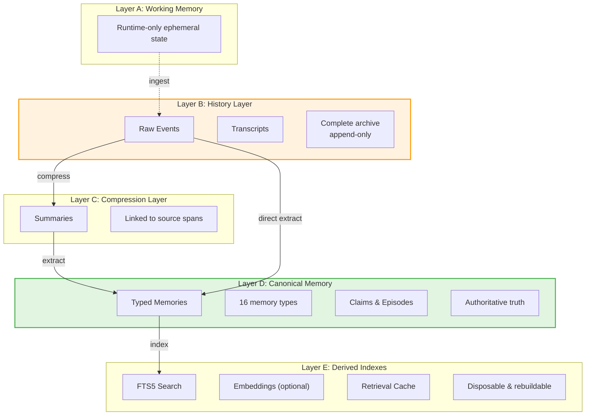
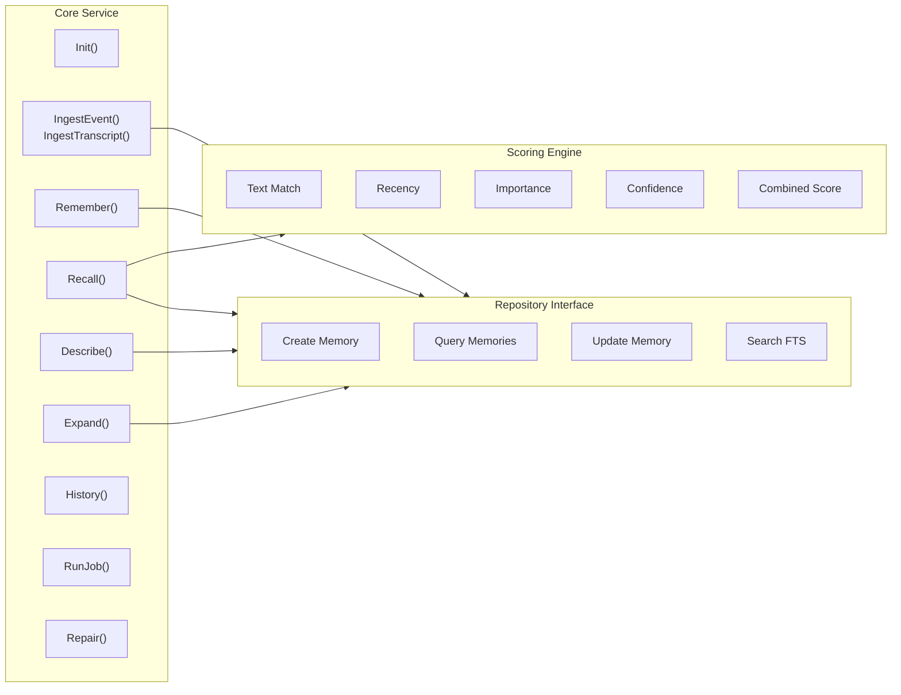
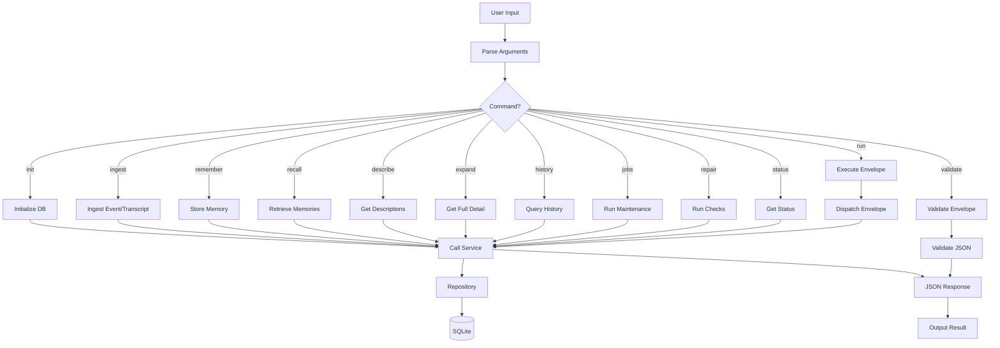
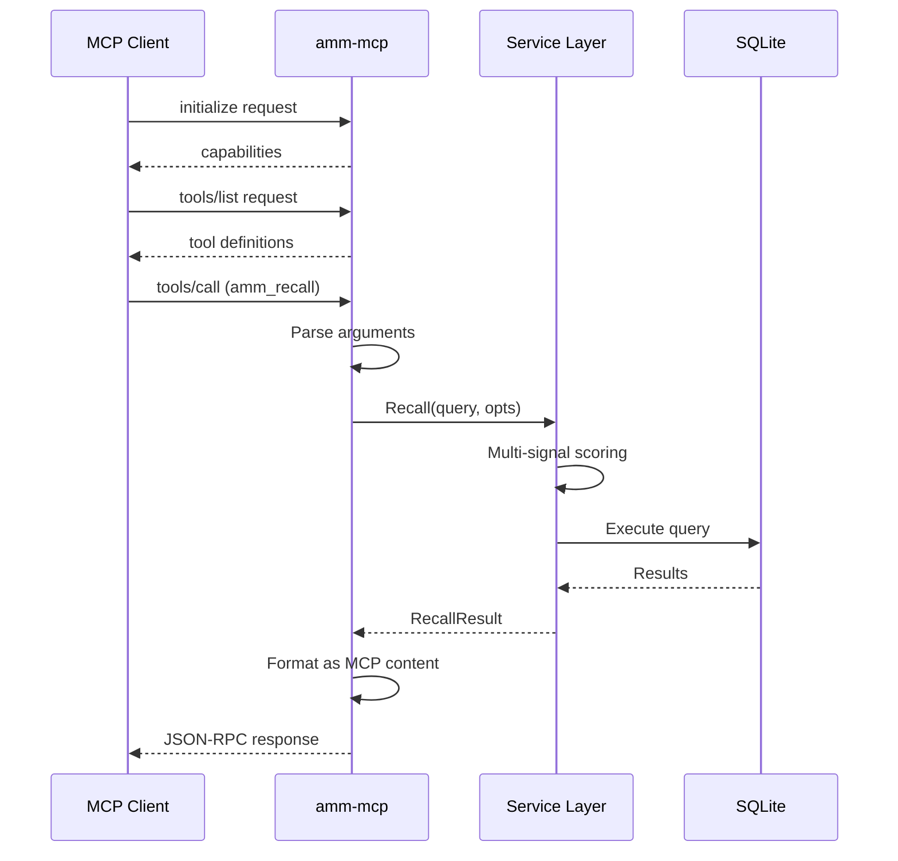
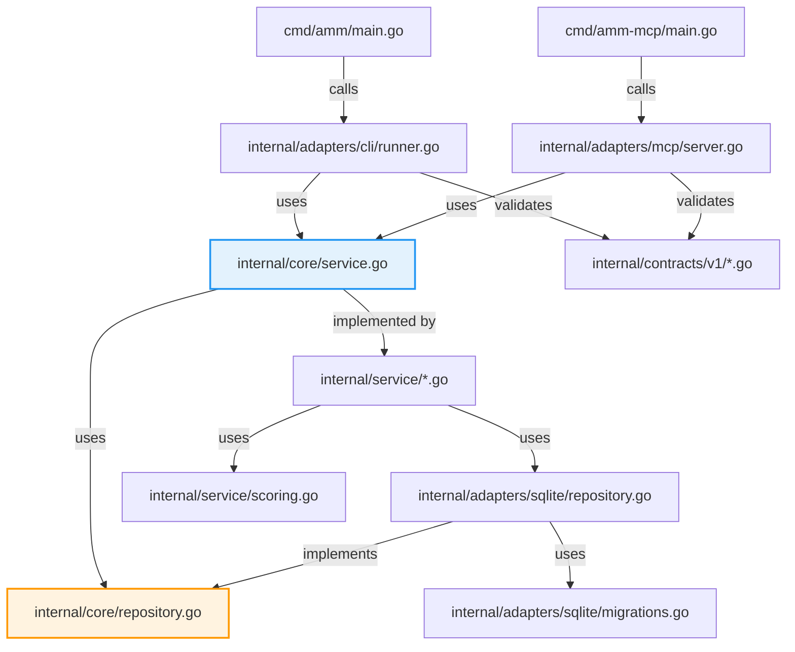

# AMM Architecture

## System Overview

```mermaid
flowchart TB
    subgraph Client["Client Layer"]
        CLI["amm CLI"]
        MCP["amm-mcp
(JSON-RPC)"]
    end

    subgraph Adapter["Adapter Layer"]
        CLIRunner["CLI Runner
(JSON envelope)"]
        MCPServer["MCP Server
(JSON-RPC 2.0)"]
    end

    subgraph Core["Core Layer"]
        Service["Service Interface
(Business Logic)"]
        Types["Domain Types
& Interfaces"]
    end

    subgraph ServiceImpl["Service Implementation"]
        Logic["Command Dispatch"]
        Recall["Recall Engine"]
        Scoring["Multi-signal Scoring"]
        Workers["Background Workers"]
    end

    subgraph Storage["Storage Layer"]
        SQLite[("SQLite
Canonical Store")]
        FTS5[("FTS5 Index")]
        Migrations[("Migrations")]
    end

    CLI --> CLIRunner
    MCP --> MCPServer
    CLIRunner --> Service
    MCPServer --> Service
    Service --> Logic
    Logic --> Recall
    Recall --> Scoring
    Logic --> SQLite
    Workers --> SQLite
    SQLite --> FTS5
    Migrations --> SQLite
```

## Data Flow

```mermaid
sequenceDiagram
    participant User as User/Agent
    participant CLI as amm CLI
    participant Service as Service Layer
    participant SQLite as SQLite DB
    participant FTS as FTS5 Index

    User->>CLI: amm remember ...
    CLI->>CLI: Parse flags
    CLI->>CLI: Build JSON envelope
    CLI->>Service: Remember(memory)
    Service->>Service: Validate input
    Service->>SQLite: INSERT memory
    SQLite->>FTS: Update index
    SQLite-->>Service: ID + Timestamp
    Service-->>CLI: Memory object
    CLI->>CLI: Wrap in envelope
    CLI-->>User: JSON result
```

## Memory Layer Architecture

```mermaid
flowchart TB
    subgraph LayerA["Layer A: Working Memory"]
        A["Runtime-only ephemeral state"]
    end

    subgraph LayerB["Layer B: History Layer"]
        B1["Raw Events"]
        B2["Transcripts"]
        B3["Complete archive
append-only"]
    end

    subgraph LayerC["Layer C: Compression Layer"]
        C1["Summaries"]
        C2["Linked to source spans"]
    end

    subgraph LayerD["Layer D: Canonical Memory"]
        D1["Typed Memories"]
        D2["16 memory types"]
        D3["Claims & Episodes"]
        D4["Authoritative truth"]
    end

    subgraph LayerE["Layer E: Derived Indexes"]
        E1["FTS5 Search"]
        E2["Embeddings (optional)"]
        E3["Retrieval Cache"]
        E4["Disposable & rebuildable"]
    end

    A -.->|ingest| B1
    B1 -->|compress| C1
    C1 -->|extract| D1
    B1 -->|direct extract| D1
    D1 -->|index| E1

    style LayerD fill:#e1f5e1,stroke:#4caf50,stroke-width:2px
    style LayerB fill:#fff3e0,stroke:#ff9800,stroke-width:2px
```

## Service Layer Detail

```mermaid
flowchart LR
    subgraph Service["Core Service"]
        direction TB
        Init["Init()"]
        Ingest["IngestEvent()
IngestTranscript()"]
        Remember["Remember()"]
        Recall["Recall()"]
        Describe["Describe()"]
        Expand["Expand()"]
        History["History()"]
        Jobs["RunJob()"]
        Repair["Repair()"]
    end

    subgraph Repository["Repository Interface"]
        R1["Create Memory"]
        R2["Query Memories"]
        R3["Update Memory"]
        R4["Search FTS"]
    end

    subgraph Scoring["Scoring Engine"]
        S1["Text Match"]
        S2["Recency"]
        S3["Importance"]
        S4["Confidence"]
        S5["Combined Score"]
    end

    Recall --> Scoring
    Recall --> Repository
    Remember --> Repository
    Ingest --> Repository
    Describe --> Repository
    Expand --> Repository
```

## Command Dispatch Flow

```mermaid
flowchart TB
    Input["User Input"] --> Parse["Parse Arguments"]
    Parse --> Route{"Command?"}
    
    Route -->|init| Init["Initialize DB"]
    Route -->|ingest| Ingest["Ingest Event/Transcript"]
    Route -->|remember| Remember["Store Memory"]
    Route -->|recall| Recall["Retrieve Memories"]
    Route -->|describe| Describe["Get Descriptions"]
    Route -->|expand| Expand["Get Full Detail"]
    Route -->|history| History["Query History"]
    Route -->|jobs| Jobs["Run Maintenance"]
    Route -->|repair| Repair["Run Checks"]
    Route -->|status| Status["Get Status"]
    Route -->|run| Envelope["Execute Envelope"]
    Route -->|validate| Validate["Validate Envelope"]
    
    Init --> Service["Call Service"]
    Ingest --> Service
    Remember --> Service
    Recall --> Service
    Describe --> Service
    Expand --> Service
    History --> Service
    Jobs --> Service
    Repair --> Service
    Status --> Service
    Envelope --> Dispatch["Dispatch Envelope"]
    Validate --> ValidateLogic["Validate JSON"]
    
    Service --> Repo["Repository"]
    Dispatch --> Service
    
    Repo --> SQLite[(SQLite)]
    
    Service --> Response["JSON Response"]
    ValidateLogic --> Response
    
    Response --> Output["Output Result"]
```

## MCP Protocol Flow

```mermaid
sequenceDiagram
    participant Client as MCP Client
    participant Server as amm-mcp
    participant Service as Service Layer
    participant DB as SQLite

    Client->>Server: initialize request
    Server-->>Client: capabilities

    Client->>Server: tools/list request
    Server-->>Client: tool definitions

    Client->>Server: tools/call (amm_recall)
    Server->>Server: Parse arguments
    Server->>Service: Recall(query, opts)
    Service->>Service: Multi-signal scoring
    Service->>DB: Execute query
    DB-->>Service: Results
    Service-->>Server: RecallResult
    Server->>Server: Format as MCP content
    Server-->>Client: JSON-RPC response
```

## Component Relationships

```mermaid
graph TB
    CLI["cmd/amm/main.go"] -->|calls| CLIRunner["internal/adapters/cli/runner.go"]
    MCP["cmd/amm-mcp/main.go"] -->|calls| MCPServer["internal/adapters/mcp/server.go"]
    
    CLIRunner -->|uses| Service["internal/core/service.go"]
    MCPServer -->|uses| Service
    
    Service -->|implemented by| ServiceImpl["internal/service/*.go"]
    Service -->|uses| Repository["internal/core/repository.go"]
    
    ServiceImpl -->|uses| SQLiteRepo["internal/adapters/sqlite/repository.go"]
    ServiceImpl -->|uses| Scoring["internal/service/scoring.go"]
    
    SQLiteRepo -->|implements| Repository
    SQLiteRepo -->|uses| Migrations["internal/adapters/sqlite/migrations.go"]
    
    CLIRunner -->|validates| Contracts["internal/contracts/v1/*.go"]
    MCPServer -->|validates| Contracts
    
    style Service fill:#e3f2fd,stroke:#2196f3,stroke-width:2px
    style Repository fill:#fff3e0,stroke:#ff9800,stroke-width:2px
```
